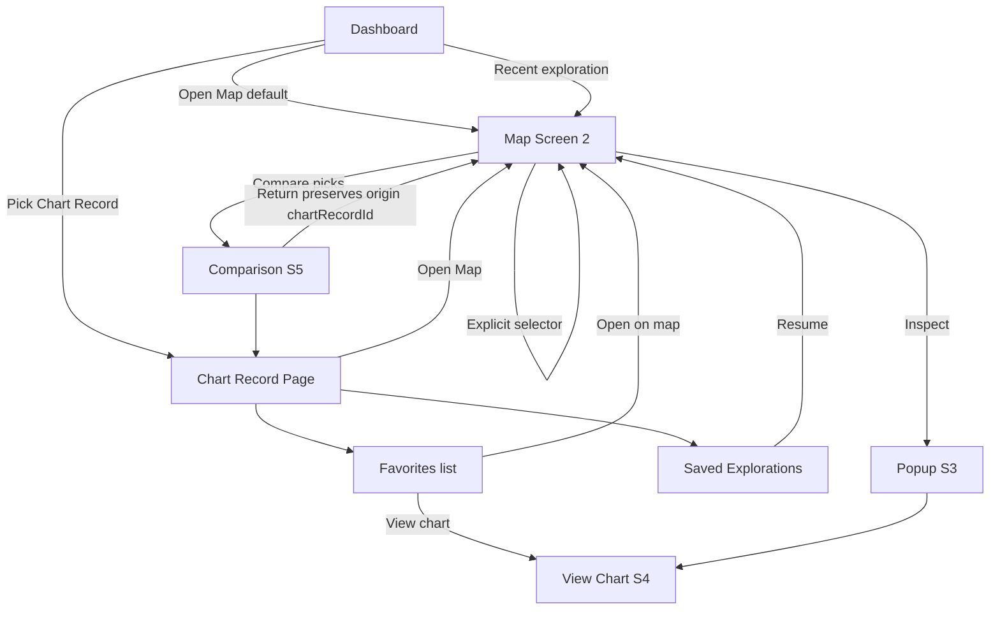

# Web 2.0 Account / Chart Workflow Architecture — Review Proposal

## Status

**ARCHITECTURE REVIEW — proposal only**

**Date:** 2026-05-29  
**Scope:** Complete Web 2.0 account/chart workflow architecture synthesized from existing doctrine. Not implementation. Not schema migration.

**Reads with:**

- `docs/architecture/client_chart_data_model_v1_2026-05-29.md` (data ownership authority)
- `docs/ux/2026-05-29_application_journey_architecture_v1.md` (screen/journey authority)
- `docs/product_workflows/professional_non_ai_workflow_v1.md`
- `docs/product_workflows/product_screen_and_transition_architecture.md`

**Purpose:** Stress-test and **propose** a coherent navigation tree, map entry/return paths, screen payloads, active-context rules, and future boxes — ready for canonical adoption after human review.

---

# Executive summary

Web 2.0 is a **Chart Record–centric** non-AI product. The **map is sacred**; dashboard, chart pages, favorites, saved explorations, and comparison are **supporting surfaces** that resume work without administration theater.

**Primary ownership unit:** Chart Record (user-facing client / chart / research / event row).  
**One user-facing chart per Chart Record.** Event and research charts are **separate Chart Records**, not nested lists.  
**Rectification is out of scope.** Birth-time uncertainty is **stored metadata** on a single Chart Record; future bounded-range work may use **internal calculation domains** on that same record — **not** multiple user-facing charts.

**Web 2.0 comparison:** 2–5 **saved places / locations** under **one** Chart Record. **Not** multi-chart comparison columns.

---

# 1. Proposed navigation hierarchy

## A. Navigation tree

```text
Account Shell
├── Dashboard (Screen 0)
│   ├── Account owner's Chart Record summary (default)
│   ├── Chart Record library (all records: clients, research, events)
│   ├── Recent saved explorations (cross-record, read-only strip)
│   └── Entry: Settings · Export (account scope)
│
├── Chart Record Page (Screen 1) — per chartRecordId
│   ├── Birth summary + confidence tier badge
│   ├── Primary: Open Map
│   ├── Favorites (inline list or sub-route)
│   ├── Saved Explorations (inline list or sub-route)
│   ├── Comparison drafts
│   ├── Full chart entry (when place selected)
│   └── Edit birth data (support route S6)
│
├── Map Discovery (Screen 2) — requires activeChartRecordId
│   ├── Drawer: context chip · conditions · layer mixer · search
│   ├── Location popup (Screen 3 — modal)
│   └── Chart selector (explicit override only)
│
├── View Chart (Screen 4) — place + active Chart Record
├── Comparison (Screen 5) — Comparison Set under one Chart Record
├── Export / Share (Screen 6)
│
└── Support routes (not journey destinations)
    ├── Settings (S5): house system, orbs, default Chart Record, clear history
    ├── Birth data intake/edit (S6)
    └── Future rooms (footer/quarantine — not primary nav)
```

## Navigation principles

| Principle | Rule |
|-----------|------|
| **Map-first** | Every Chart Record page offers one obvious **Open Map** action |
| **No orphan context** | Routes carry `chartRecordId`; never infer silently |
| **Flat library** | Chart Records are a flat list — no nested chart folders in Web 2.0 |
| **Professional future** | Same tree scales to multi-client accounts; no separate “pro nav” yet |
| **Settings recessive** | History clear, global defaults, Layer 2 — not on map chrome |

## Recommended route IDs (conceptual)

| Route | Params |
|-------|--------|
| `/dashboard` | |
| `/chart/:chartRecordId` | Chart Record home |
| `/chart/:chartRecordId/favorites` | Optional dedicated list |
| `/chart/:chartRecordId/explorations` | Optional dedicated list |
| `/map` | `?chartRecordId=&explorationId=&placeId=` |
| `/chart/:chartRecordId/chart-view/:placeId` | Full relocated chart |
| `/chart/:chartRecordId/compare/:comparisonSetId` | Comparison workspace |
| `/export` | scope query params |
| `/settings` | |

Dedicated Favorites / Saved Explorations **sub-routes** are optional in v1 — Chart Record page may inline both with “see all” links. Prefer **inline + drill-down** over many top-level nav items.

---

# 2. User journey diagrams

## B. Map entry paths (exact)

| # | Path | Sets activeChartRecordId | Hydrates |
|---|------|---------------------------|----------|
| 1 | **Dashboard → Open Map** | `defaultChartRecordId` (account owner’s configured default) — **not** “last used chart” in Web 2.0 MVP | Empty exploration draft for that record |
| 2 | **Dashboard → recent exploration → Map** | Exploration's `chartRecordId` | Full saved exploration semantics |
| 3 | **Chart Record page → Open Map** | That `chartRecordId` | That record’s most recent search / history / pinned maps |
| 4 | **Favorite → Map** | Favorite’s **owning Chart Record** (same user-facing client/chart record) | Hydrate record **plus** favorite’s saved place; center / optional popup |
| 5 | **Favorite → View Chart** | Owning Chart Record | Place-scoped full chart (Screen 4) |
| 6 | **Saved exploration → Resume → Map** | Exploration's `chartRecordId` | Conditions + viewport + layer UI state |
| 7 | **Comparison → Back to Map / Chart page** | **Originating** Chart Record (stored on Comparison Set) | Preserve origin context; optional pre-compare viewport. **Facts only — no ranking, no interpretation.** |
| 8 | **Map chart selector** | User-selected Chart Record (**explicit override only**) | Becomes active map context **until changed again**. **Never silent.** Confirm if dirty draft. |
| 9 | **Deep link → Map** | URL `chartRecordId` required | Semantic replay — conditions + viewport |



## C. Leaving map and returning

| Exit from map | What persists | Return behavior |
|---------------|---------------|-----------------|
| **Back to Chart Record page** | Auto-save exploration draft (async) | Chart page shows updated recent explorations / favorites |
| **Back to Dashboard** | Same draft save | Dashboard shows cross-record recent strip |
| **Open View Chart** | `activePlaceId` + chartRecordId | Return to map restores same record + optional same viewport |
| **Open Comparison** | Comparison Set created with **originatingChartRecordId** | Return to map uses originating record, not a silent switch |
| **Export modal** | Scope snapshot | Close returns to prior route + context |
| **Explicit chart selector switch** | New activeChartRecordId; prior draft marked for prior record | User override until changed again |

**Return stack (conceptual):**

```text
navigationStack: [
  { route, chartRecordId, explorationId?, placeId?, comparisonSetId? }
]
```

**Rules:**

- Returning from Comparison **must not** silently change `activeChartRecordId` away from the Comparison Set's owning / originating Chart Record unless user explicitly switches chart on map.
- Map auto-save **never blocks** back navigation (user sovereignty).
- Unsaved dirty exploration: optional lightweight indicator on Chart Record page — not a blocking modal in Web 2.0.

---

# 3. Active-context doctrine

## Session contract

```text
activeChartRecordId     — required on map and all mutations
activeSavedExplorationId — optional; hydrates conditions + viewport
activePlaceId           — optional; popup / chart view context
activeComparisonSetId   — optional; when in comparison flow
originatingChartRecordId — preserved when entering comparison from map/chart page
defaultChartRecordId    — account setting; dashboard → map default
```

## Ownership rules (Web 2.0)

| Object | Owner |
|--------|-------|
| Favorites | One Chart Record |
| Saved explorations | One Chart Record |
| Map/search history | One Chart Record |
| Inline notes | One Chart Record (optional place scope on child object) |
| Comparison Set (MVP) | One Chart Record + 2–5 **places** |
| Selected locations in session | Scoped to active Chart Record |

## Chart switching

- **Always explicit** — map chart selector, dashboard pick, or Chart Record page entry.
- **Never silent** — no auto-switch when favoriting, resuming cross-record dashboard items, or returning from comparison.
- **Map chart selector:** Once the user selects a Chart Record, that record is **active map context until changed again**.
- **Dirty draft:** If exploration draft is dirty on switch, confirm fork/discard — doctrine: no silent data loss.

## Dashboard default

- **`defaultChartRecordId`** = account owner’s primary Chart Record (self-chart for lay user; primary client or self for professional).
- Dashboard → Open Map uses this default — **do not use “last chart” as default** unless explicitly decided in a later product pass.
- When the user navigates to **another Chart Record page**, that page surfaces **that record’s** most recent search, history, and pinned maps — not the dashboard default.
- Multi-client professionals: flat Chart Record library; default remains configured owner record, not session memory.

---

# 4. Screen information architecture (D)

## Dashboard (Screen 0)

| Show | Hide |
|------|------|
| Account owner's Chart Record card (name, birth one-liner, tier badge) | Map as primary surface |
| **Open Map** (default record) | Condition editor |
| Chart Record library (flat list) | Scoring / AI panels |
| Recent saved explorations (cross-record, 3–5 items) | Mandatory onboarding wizard |
| Create Chart Record (minimal) | Marketplace / courses |
| Settings entry | |

**Tone:** calm library — resume exploration, not SaaS dashboard grid.

## Chart Record page (Screen 1)

| Show | Hide |
|------|------|
| Display name + record type hint (client / research / event) | Full condition stack |
| Birth date · time · place · **confidence tier** | Nested charts |
| **Open Map** (primary CTA) | Rectification workflow |
| Favorites strip (5–8 + see all) | Oracle summaries |
| Saved explorations (recent + pinned) | |
| Comparison drafts | |
| Export entry | |
| Edit birth data link | |

## Favorites (inline or `/favorites` sub-route)

| Show | Hide |
|------|------|
| Place name + optional user label | Cross-record favorites |
| Inline note preview | Ranking / scores |
| Open on map · View chart · Remove | |
| Chart Record context header (which record owns this list) | |

## Saved Explorations (inline or `/explorations` sub-route)

| Show | Hide |
|------|------|
| Name or auto-title (conditions summary) | Interpretive labels |
| Updated / pinned indicator | Mandatory rename gate |
| Optional intention (user text) | |
| Resume → Map | |
| Chart Record context header | |

---

# 4.5 Map / search history (Web 2.0)

| Rule | Detail |
|------|--------|
| Scope | History is **per Chart Record** — not a global undifferentiated log |
| Chart Record page | Shows that record’s recent search / map / inspect history |
| Settings | **Clear this chart’s history** — scoped to active or selected Chart Record |
| Account-wide | **Clear all history** may exist as a **separate**, lower-priority control — not on main map chrome |
| Tone | Behavioral facts only — same prohibitions as saved explorations |

---

# 5. Comparison workflow (Web 2.0)

## MVP model (canonical for Web 2.0)

**One Comparison Set = one originating Chart Record + 2–5 selected places / saved locations.**

- Columns are **places**, not Chart Records.
- All columns use the **same natal domain** from the originating Chart Record.
- **Facts only** — no ranking, no interpretation, no winner, no score.
- **Does NOT mean** multi-chart comparison columns (future professional edge case only).

## Entry

- From map: user selects 2–5 favorites or inspected places → Compare.
- From Chart Record page: open comparison draft or start from favorites.

## Return paths

| Action | Preserves |
|--------|-----------|
| **Back to Map** | `originatingChartRecordId` on Comparison Set + optional viewport |
| **Back to Chart Record page** | Same originating Chart Record — no silent switch |
| **Open place chart from column** | placeId + originating Chart Record |

**Do not implement** multi–Chart Record comparison columns in Web 2.0 UI (future box only).

---

# 5.5 Web 2.0 search conditions and naming

| Technical type | Role in Web 2.0 |
|----------------|-----------------|
| **planet-in-house** | Active Layer 1 condition |
| **angle-in-sign** | Active Layer 1 condition |
| **aspect-to-angle** | Active Layer 1 condition |
| **Transit placement / search** | **Post-v1 future box only** — not in Web 2.0 UI or persistence |

Technical condition names are accurate for engine and storage contracts. **User-facing labels may change later** — do not rename types until product copy is decided.

---

# 6. Future professional / client support (section 9 focus)

## E. Future features — architectural boxes **now**

| Feature | Box type | Notes |
|---------|----------|-------|
| **Birth-time uncertainty gradients** | Internal property of single Chart Record | `candidateChartDomains[]` reserved; multiple internal calculations OK; **one user-facing chart**. Unknown time → cannot run relocation honestly; very broad uncertainty → guide user to better records |
| **Bounded range / likely center** | Same record metadata | Post-AI; no v1 engine; not multiple user-facing charts |
| **AI interpretations** | Layer 3 — disabled controls | Never on Web 2.0 data path |
| **Composite charts** | Separate Chart Record type (future) | Not nested under client |
| **Professional multi-client** | Flat Chart Record library + ACL (future) | Same nav tree; add sharing permissions later |
| **Shared maps / investigation links** | Export + deep link schema | Semantic replay only |
| **Copy favorites / import** | Utility between Chart Records | Explicit user action |
| **Case / Person grouping** | Optional parent entity | Groups records without breaking 1:1 map ownership |
| **Transit conditions** | Post-v1 future box | Web 2.0: planet-in-house, angle-in-sign, aspect-to-angle only |
| **Voice notes** | Inline note `source` field | Transcription → text |

## F. Future features — **no** architectural complexity yet

| Feature | Why defer |
|---------|-----------|
| Rectification workflow | Out of scope entirely — not a Web 2.0 path |
| Multi-chart-per-client UI | Violates Web 2.0 ownership clarity |
| Nested chart collections / folders | Administration creep |
| Mandatory behavioral analytics pipeline | Post-v1 optional |
| Interpretation / motif labeling from history | Data yes; meaning no |
| Marketplace / Layer 5 courses | Quarantined |
| Multi–Chart Record comparison columns | Future professional edge case |
| Per-chart house system override | Global setting sufficient for v1 |
| Standalone polymorphic Note entity | Inline notes sufficient |
| Real-time collaboration / shared editing | Not Web 2.0 |

---

# 7. Open questions

| # | Question | Options | Recommendation |
|---|----------|---------|----------------|
| 1 | **Favorites / explorations: inline vs sub-route** | All on Chart Record page vs dedicated pages | **Inline + see all** sub-route when list > 8 |
| 2 | **Dirty exploration on chart switch** | Auto-fork vs confirm discard | **Confirm** when dirty; auto-save per record |
| 3 | **Lay vs professional dashboard** | Same tree vs simplified | **Same tree**; copy differs (“My chart” vs “Clients”) |
| 4 | **Cross-record recent on dashboard** | Show vs hide | **Show read-only strip**; resume always sets correct `chartRecordId` |
| 5 | **Map ↔ production handoff** | When to wire `map_CURRENT.html` | After `AppRoute` + semantic context contract — not Web 2.0 shell |
| 6 | **“Last used chart” as dashboard default** | Session memory vs fixed default | **Deferred** — Web 2.0 uses `defaultChartRecordId` only unless explicitly reopened |

**Resolved (v1.1 review pass):**

| Topic | Decision |
|-------|----------|
| Comparison scope | **2–5 places under one Chart Record** — not multi-chart columns |
| Dashboard → map default | Account owner’s **`defaultChartRecordId`** — not last chart |
| Birth-time uncertainty | Internal gradient on **one** Chart Record — not multiple user-facing charts |
| Favorite → map | Hydrate owning Chart Record + saved place |
| Condition naming | Keep technical names; user-facing rename deferred |

---

# 8. Recommendations

## R1 — Adopt Chart Record–centric nav as canonical

Promote this review (or a trimmed successor) to `docs/architecture/web2_account_chart_workflow_v1_2026-05-29.md` after human sign-off.

## R2 — Comparison doctrine (aligned)

Web 2.0 comparison is **N places × 1 Chart Record**. Both architecture docs now state this explicitly.

## R3 — Birth-time future box (aligned)

Internal birth-time candidates live on **one user-facing Chart Record**. Separate Chart Records remain for **event / research / composite (future)** — not uncertainty variants or rectification.

## R4 — Implement navigation stack in app shell next

Before map integration: route params + `window.__rmAppContext` carrying `chartRecordId`, `explorationId`, `originatingChartRecordId`.

## R5 — Dashboard MVP payload

Ship Dashboard with: default record card, Open Map, flat Chart Record list, recent explorations strip — nothing else.

## R6 — Do not add Note entity or analytics in v1 schema bump

Inline notes + optional history table only; defer `BehavioralEvent[]`.

## R7 — Professional future

When adding client ACL: attach to Chart Record rows, not a parallel client hierarchy — preserves flat library UX.

---

# Appendix — Doctrine alignment checklist

| Doctrine | Aligned? | Notes |
|----------|----------|-------|
| Chart Record = ownership unit | Yes | |
| One user-facing chart per record | Yes | |
| Event / research = separate records | Yes | |
| Composite = future separate record | Yes | |
| Rectification out of scope | Yes | |
| Uncertainty internal to one record (future) | Yes | Internal calculations; one user-facing chart |
| Comparison = places under one record | Yes | Not multi-chart columns |
| Dashboard default = owner record (not last chart) | Yes | |
| Favorite hydrates record + place | Yes | |
| Favorites / notes / history / explorations per record | Yes | |
| Condition naming deferred | Yes | |
| Comparison return preserves origin | Yes | |
| Explicit chart switching | Yes | |
| Facts before interpretation | Yes | |
| User sovereignty | Yes | |

---

# Revision

| Version | Date | Change |
|---------|------|--------|
| v1 | 2026-05-29 | Initial architecture review proposal |
| v1.1 | 2026-05-29 | Aligned with data model: comparison = places; dashboard default; favorite hydration; history; birth-time gradient; transit/naming; resolved open questions |

---

# Document metadata (audit trail)

## Exact files modified

- `docs/architecture/client_chart_data_model_v1_2026-05-29.md`
- `docs/architecture/web2_account_chart_workflow_architecture_review_v1_2026-05-29.md`

## Files modified (this pass)

Both targets above — documentation only.

## Safe-to-commit assessment

**Yes — safe to commit both architecture docs together.** Docs-only; no code, schema, or Supabase changes. Comparison, dashboard default, birth-time uncertainty, and transit doctrine are now aligned across both files.

## Suggested commit message

```bash
git add docs/architecture/client_chart_data_model_v1_2026-05-29.md \
        docs/architecture/web2_account_chart_workflow_architecture_review_v1_2026-05-29.md
git commit -m "Align Web 2.0 architecture docs on comparison, context, and birth-time doctrine"
```
