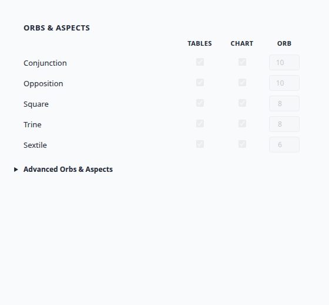

# SETTINGS-V3-4C Closeout

**Task:** Fix Orbs & Aspects grid in `#/settings-v3/charts`  
**Branch:** `cursor/settings-v3-4b-charts-4b87`  
**Scope:** Charts section only; legacy `#/settings` untouched; no backend changes

## UI refinements completed

### 1. Header alignment
- Grid column order is now **Aspect Name | Tables | Chart | Orb**
- Headers sit on one row: spacer (name column) · **Tables** (col 2) · **Chart** (col 3) · **Orb** (col 4)
- Removed misaligned umbrella "Orbs" / "Aspects" headers that placed ORB over the wrong column

### 2. Major aspects default state
- All five major aspect rows remain visible by default
- Tables and Chart checkboxes default **checked** and **disabled** (`data-sv3-major-lock`, `.is-locked`)
- Orb inputs default **visible** and **disabled** with greyed styling

### 3. Advanced toggle
- Renamed to **Advanced Orbs & Aspects**
- When `#rm-sv3-advanced-orbs` is expanded:
  - Major aspect Tables/Chart checkboxes become editable
  - Major aspect orb fields become editable
  - Minor aspect rows appear (with matching header row)
  - Minor aspect checkboxes and orb fields are editable
- Save preserves existing major/minor values when advanced is collapsed (reads from effective settings)

## Files changed

| File | Change |
|------|--------|
| `app_shell.html` | Grid CSS, `sv3AspectRow` column order, headers, major lock logic, advanced rename, `applySettingsV3AdvancedState`, `collectSettingsV3Patch` |
| `scripts/smoke_settings_v3_4c_orbs_grid.py` | Static smoke for 4C grid contract |
| `scripts/smoke_settings_v3_4b_charts.py` | Updated header assertions for 4C |
| `scripts/capture_settings_v3_4c_screenshot.py` | Screenshot capture helper |

## Validation

```text
python3 scripts/smoke_settings_v3_4c_orbs_grid.py   PASS 12/12
python3 scripts/smoke_settings_v3_4b_charts.py      PASS 22/22 (regression)
```

## Screenshot



Preview source: `results/settings_v3_4c_orbs_grid_preview.html`

## Rejected scope

- Map / chart page consumer wiring (deferred until format sign-off)
- Legacy Settings page changes
- New backend/settings keys

**VERIFIED**
